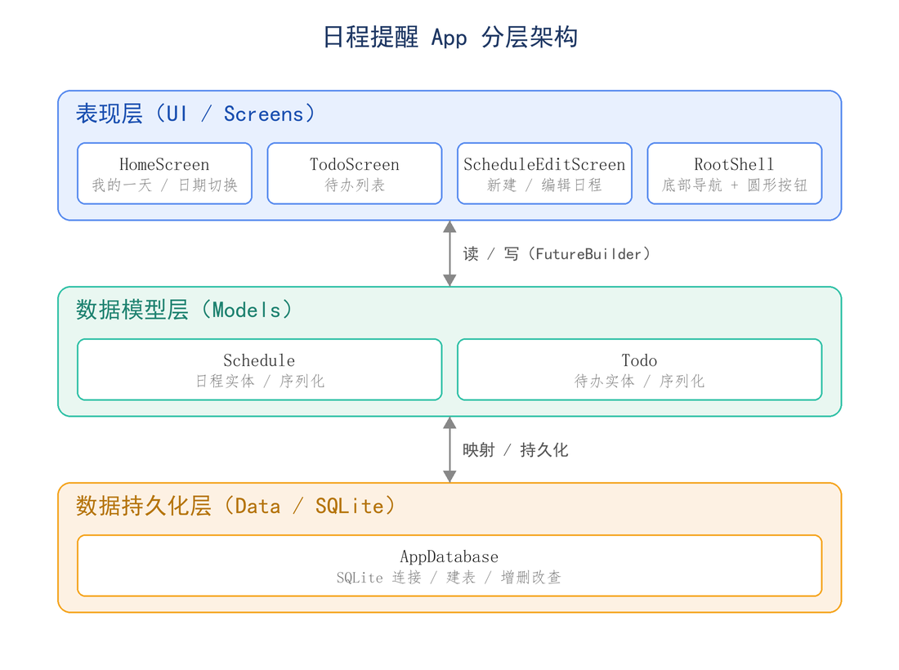

# 移动终端程序设计结课报告

## 摘要

本项目是一款运行于 Android 平台的手机日程提醒应用，使用 Flutter 跨平台框架开发，采用 Dart 语言编写，并以 SQLite 数据库实现数据的本地持久化保存。应用围绕"我的一天"日程浏览（支持任意日期切换）、屏幕底部正中的圆形新建按钮、以及独立的待办清单三大核心功能展开，界面遵循 Material Design 3 规范，配色柔和、操作简洁。本报告依次阐述需求分析、技术选型、系统设计、数据库设计、核心模块实现、界面设计、关键技术、测试验证与项目结构，并对成果与不足进行总结。

## 1 项目概述

本项目是一款运行于 Android 平台的手机日程提醒应用，使用 Google 的 Flutter 跨平台框架开发，采用 Dart 语言编写，使用 SQLite 作为本地数据库实现数据的持久化保存。

应用面向日常时间管理场景，帮助用户记录每天的日程安排与待办事项。核心交互围绕三个部分展开：以"我的一天"为中心的日程浏览页（支持任意日期切换）、位于屏幕底部正中的圆形新建按钮、以及独立的待办清单页。整体界面遵循 Material Design 3 设计规范，配色柔和友好，操作路径简洁。

设计目标可概括为三点：

1. 直观：打开即见当天日程，切换日期只需一次点击或滑动。
2. 轻量：所有数据存于本机 SQLite，无需联网、无需登录，启动即用。
3. 完整：日程与待办均支持完整的增、删、改、查与状态标记。

## 2 需求分析

### 2.1 功能性需求

应用的功能性需求如表 2.1 所示。

表 2.1 功能性需求表

| 编号 | 需求描述 | 优先级 |
| --- | --- | --- |
| F1 | 首页"我的一天"展示选定日期的全部日程 | 高 |
| F2 | 支持日期切换：顶部一周日期条滑动与日历选择器跳转任意日期 | 高 |
| F3 | 屏幕底部正中提供圆形悬浮按钮，用于新建日程 | 高 |
| F4 | 新建与编辑日程：标题、日期、起止时间、全天开关、颜色标记、备注 | 高 |
| F5 | 日程可勾选完成，可删除 | 中 |
| F6 | 独立的待办页，展示全部待办并可新建 | 高 |
| F7 | 待办支持优先级、截止时间、勾选完成、左滑删除 | 中 |
| F8 | 所有数据使用数据库持久化，重启应用后不丢失 | 高 |

### 2.2 非功能性需求

非功能性需求包括以下四个方面：

1. 持久性：采用关系型本地数据库 SQLite，保证数据可靠落盘。
2. 响应性：列表查询按天索引，单日数据加载迅速。
3. 易用性：符合移动端操作习惯，包括底部导航、悬浮按钮、左滑删除、底部弹窗等。
4. 本地化：界面文案与日期格式全面中文化。

### 2.3 用例概述

典型用户操作流程如下：

1. 启动应用，默认进入"我的一天"，显示今日日程。
2. 通过顶部日期条或日历图标切换到目标日期查看或规划当天安排。
3. 点击底部正中圆形按钮新建日程，填写信息后保存。
4. 在日程卡片上勾选完成，或点击进入编辑、删除。
5. 切换到"待办"页，新建待办并设置优先级与截止时间。
6. 完成待办后勾选，或左滑删除。

## 3 开发环境与技术选型

### 3.1 开发环境

开发环境配置如表 3.1 所示。

表 3.1 开发环境配置表

| 项目 | 版本与说明 |
| --- | --- |
| 操作系统 | Linux（WSL2 环境） |
| Flutter SDK | 3.24.5（stable） |
| Dart SDK | 3.5.4 |
| JDK | OpenJDK 17（Temurin） |
| Android SDK | Platform 34、Build-Tools 34.0.0、Platform-Tools |
| 构建工具 | Gradle（随 Flutter Android 工程自动管理） |

### 3.2 技术选型说明

各项技术的选型理由如表 3.2 所示。

表 3.2 技术选型说明表

| 技术 | 选型理由 |
| --- | --- |
| Flutter | 单一代码库即可构建高性能、可定制 UI 的移动应用，自带丰富的 Material 组件，适合快速实现美观界面 |
| Dart | Flutter 官方语言，支持空安全，语法简洁 |
| sqflite | Flutter 生态中成熟的 SQLite 封装库，提供事务、索引、原生 SQL 能力，满足关系型持久化需求 |
| path | 跨平台拼接数据库文件路径 |
| intl | 提供日期与时间的本地化格式化（中文星期、年月日） |
| flutter_localizations | 为日期选择器、时间选择器等系统组件提供中文界面 |

### 3.3 依赖清单

项目主要依赖在 pubspec.yaml 中声明，如代码清单 3.1 所示。

代码清单 3.1 项目依赖声明（pubspec.yaml 节选）

```yaml
dependencies:
  flutter:
    sdk: flutter
  flutter_localizations:
    sdk: flutter
  sqflite: ^2.3.3+1   # SQLite 数据库
  path: ^1.9.0        # 数据库路径拼接
  intl: ^0.19.0       # 中文日期格式化
  cupertino_icons: ^1.0.8
```

## 4 系统总体设计

### 4.1 分层架构

应用采用清晰的三层结构，职责分离，便于维护，如图 4.1 所示。



图 4.1 系统分层架构图

三层职责说明如下：

1. 表现层：负责界面渲染与用户交互，通过 FutureBuilder 异步读取数据并刷新。
2. 模型层：定义 Schedule、Todo 实体，封装对象与数据库行之间的相互转换。
3. 持久化层：单例 AppDatabase，统一管理数据库连接、建表与增删改查。

### 4.2 导航结构

应用主体为 RootShell，使用 Scaffold、BottomAppBar 与 IndexedStack 实现，结构如下：

1. 底部导航栏左侧页签为"我的一天"。
2. 底部导航栏右侧页签为"待办"。
3. 两个页签中间通过 CircularNotchedRectangle 留出缺口，嵌入 centerDocked 定位的圆形新建按钮。

IndexedStack 保证两个页面切换时状态不丢失。

## 5 数据库设计

应用使用 SQLite，数据库文件名为 reminder.db，版本号为 1，包含两张表。

### 5.1 日程表 schedules

日程表用于保存全部日程记录，其结构如表 5.1 所示。

表 5.1 日程表 schedules 结构

| 字段 | 类型 | 约束 | 说明 |
| --- | --- | --- | --- |
| id | INTEGER | PRIMARY KEY AUTOINCREMENT | 主键 |
| title | TEXT | NOT NULL | 日程标题 |
| note | TEXT | 可空 | 备注 |
| start_ms | INTEGER | NOT NULL | 开始时间（毫秒时间戳） |
| end_ms | INTEGER | 可空 | 结束时间（毫秒时间戳） |
| day_key | TEXT | NOT NULL | 所属日期（yyyy-MM-dd），用于按天查询 |
| all_day | INTEGER | NOT NULL DEFAULT 0 | 是否全天（0 或 1） |
| color | INTEGER | NOT NULL | 颜色标记（ARGB 整数） |
| done | INTEGER | NOT NULL DEFAULT 0 | 是否完成（0 或 1） |

为加速按日期查询，建立索引，如代码清单 5.1 所示。

代码清单 5.1 日程表按天索引

```sql
CREATE INDEX idx_schedule_day ON schedules(day_key);
```

### 5.2 待办表 todos

待办表用于保存全部待办事项，其结构如表 5.2 所示。

表 5.2 待办表 todos 结构

| 字段 | 类型 | 约束 | 说明 |
| --- | --- | --- | --- |
| id | INTEGER | PRIMARY KEY AUTOINCREMENT | 主键 |
| title | TEXT | NOT NULL | 待办内容 |
| done | INTEGER | NOT NULL DEFAULT 0 | 是否完成（0 或 1） |
| priority | INTEGER | NOT NULL DEFAULT 0 | 优先级（0 普通 / 1 重要 / 2 紧急） |
| created_ms | INTEGER | NOT NULL | 创建时间（毫秒时间戳） |
| due_ms | INTEGER | 可空 | 截止时间（毫秒时间戳） |

### 5.3 设计要点

数据库设计的关键考量如下：

1. 时间以毫秒时间戳存储：避免时区与字符串解析问题，比较与排序高效。
2. 冗余 day_key 字段：日程查询以天为单位，单独存储格式化日期串并加索引，避免每次查询都做时间区间运算。
3. 布尔以 0 或 1 整数表示：SQLite 无原生布尔类型，由模型层负责与 Dart 布尔值互转。

## 6 核心功能模块实现

### 6.1 数据持久化层

数据持久化层采用单例模式，懒加载数据库连接，如代码清单 6.1 所示。

代码清单 6.1 AppDatabase 单例与连接

```dart
class AppDatabase {
  AppDatabase._();
  static final AppDatabase instance = AppDatabase._();

  Database? _db;
  Future<Database> get database async => _db ??= await _open();
}
```

该层提供的主要方法如下：

1. 日程：insertSchedule、updateSchedule、deleteSchedule、schedulesForDay。
2. 待办：insertTodo、updateTodo、deleteTodo、allTodos。

其中按天查询使用参数化 SQL，防止注入，如代码清单 6.2 所示。

代码清单 6.2 按天查询日程

```dart
final rows = await db.query('schedules',
    where: 'day_key = ?', whereArgs: [key],
    orderBy: 'all_day DESC, start_ms ASC');
```

待办列表排序规则为未完成在前，再按优先级由高到低、创建时间由新到旧，如代码清单 6.3 所示。

代码清单 6.3 待办排序规则

```dart
orderBy: 'done ASC, priority DESC, created_ms DESC'
```

### 6.2 数据模型层

Schedule 与 Todo 均实现 toMap 与 fromMap，完成对象与数据库行的双向映射，并提供 copyWith 支持不可变更新（如勾选完成时生成一个 done 取反的新对象）。

Schedule 还通过 getter 计算 dayKey，保证写库时 day_key 始终与开始时间一致，如代码清单 6.4 所示。

代码清单 6.4 dayKey 计算

```dart
String get dayKey =>
    '${start.year.toString().padLeft(4, '0')}-'
    '${start.month.toString().padLeft(2, '0')}-'
    '${start.day.toString().padLeft(2, '0')}';
```

### 6.3 首页我的一天

首页 HomeScreen 实现要点如下：

1. 维护当前选中日期 _selected，通过 FutureBuilder 异步加载 schedulesForDay。
2. 顶部周日期条以选中日为中心展示前后共 31 天，可横向滚动，当天有描边高亮、选中日填充主色。
3. 右上角日历按钮调用 showDatePicker 跳转任意日期。
4. 日程以卡片列表展示，含颜色色条、时间、标题、备注，右侧圆圈点击即可切换完成状态。
5. 当天无日程时显示友好的空状态提示。
6. 暴露 reload 方法供外壳在新建或编辑后刷新列表。

### 6.4 新建与编辑日程

日程编辑页 ScheduleEditScreen 实现要点如下：

1. 同一界面兼顾新建与编辑，由是否传入 existing 参数区分。
2. 使用 Form 与 TextFormField 做标题非空校验。
3. 日期、起止时间分别用 showDatePicker、showTimePicker 选取，选择开始时间晚于结束时间时自动顺延结束时间一小时。
4. 全天开关打开时隐藏时间选择。
5. 提供 6 种颜色标记供选择。
6. 编辑态额外提供删除按钮，并带二次确认弹窗。

### 6.5 待办页

待办页 TodoScreen 实现要点如下：

1. 使用 FutureBuilder 加载全部待办，顶部显示未完成数量统计。
2. 右下角 FloatingActionButton 唤起底部弹窗新建待办，可设标题、优先级、截止时间。
3. 每项待办用 Dismissible 实现左滑删除，圆圈勾选完成，重要或紧急项显示彩色优先级标签。

## 7 界面设计

### 7.1 设计语言

界面设计语言要点如下：

1. 基于 Material Design 3，主色取自蓝色种子色 5B8DEF，通过 ColorScheme.fromSeed 自动生成协调的配色方案。
2. 统一圆角卡片、浅灰背景、留白充足，视觉柔和。
3. 输入框、按钮、对话框风格统一在 AppTheme 中集中配置。

### 7.2 关键交互

应用的关键交互及其实现方式如表 7.1 所示。

表 7.1 关键交互实现表

| 交互 | 实现方式 |
| --- | --- |
| 底部正中圆形新建按钮 | FloatingActionButton 配合 centerDocked 与 BottomAppBar 凹口 |
| 日期快速切换 | 横向滚动周条与日历弹窗 |
| 新建待办 | 底部上滑弹窗，键盘自适应抬升 |
| 删除 | 日程二次确认弹窗，待办左滑删除 |
| 完成状态 | 圆圈图标点击切换，完成项加删除线并置灰 |

### 7.3 本地化

通过 flutter_localizations 与 intl 实现中文界面与中文日期格式（如 2026 年 6 月 22 日 星期一），系统日期与时间选择器同样显示中文。

## 8 关键技术与难点

本项目的关键技术与难点如下：

1. 底部凹口圆形按钮的实现：通过 BottomAppBar 的 CircularNotchedRectangle 形状与 centerDocked 定位配合，在两个导航页签中间精确嵌入圆形按钮，并在布局中预留占位以避免文字与按钮重叠。
2. 按天高效查询日程：日程的开始时间是精确到分钟的时间戳，但首页查询以天为单位。方案是写库时额外冗余存储 day_key 并建立索引，查询时直接等值匹配，避免对时间戳做区间扫描。
3. 页面间数据刷新：新建或编辑通过路由返回布尔值通知调用方，外壳与首页据此调用 reload 重新查询，保证界面与数据库一致。
4. 不可变模型与 copyWith：模型对象不可变，状态变更通过 copyWith 生成新对象后写库再刷新，逻辑清晰、易于排错。
5. 环境搭建：在无管理员权限的受限环境中，将 Flutter、JDK、Android SDK 全部以用户态方式安装并配置环境变量，最终成功打包出可安装的 APK。

## 9 测试与验证

### 9.1 静态检查

执行 flutter analyze，结果为 No issues found，即无错误、无警告。

### 9.2 组件测试

编写组件冒烟测试，验证应用可正常构建并渲染底部两个页签与中间新建按钮，如代码清单 9.1 所示。

代码清单 9.1 组件冒烟测试

```dart
testWidgets('App builds and shows bottom navigation', (tester) async {
  await tester.pumpWidget(const ReminderApp());
  await tester.pump();
  expect(find.text('我的一天'), findsWidgets);
  expect(find.text('待办'), findsWidgets);
  expect(find.byIcon(Icons.add), findsOneWidget);
});
```

执行 flutter test，结果为 All tests passed。

### 9.3 构建验证

执行 flutter build apk --debug，成功产出安装包 app-debug.apk。受开发环境限制（无模拟器与真机），功能验证止于成功编译并打包为 APK，运行时交互需将 APK 安装至 Android 设备体验。

### 9.4 功能测试用例

建议在真机执行的功能测试用例如表 9.1 所示。

表 9.1 功能测试用例表

| 用例 | 步骤 | 预期结果 |
| --- | --- | --- |
| 新建日程 | 点新建按钮，填标题与时间，保存 | 列表出现该日程，重启后仍在 |
| 日期切换 | 滑动周条或选日历 | 列表刷新为对应日期的日程 |
| 完成日程 | 点日程右侧圆圈 | 标题加删除线并置灰 |
| 删除日程 | 进编辑，删除，确认 | 列表移除该项 |
| 新建待办 | 待办页点新建，填写，添加 | 列表出现该待办 |
| 左滑删除待办 | 在待办项上左滑 | 该项被移除 |

## 10 项目结构说明

项目目录结构如代码清单 10.1 所示。

代码清单 10.1 项目目录结构

```
reminder_app/
  lib/
    main.dart                     程序入口与底部导航外壳（含中间圆形按钮）
    theme.dart                    全局主题与配色
    models/
      schedule.dart               日程数据模型
      todo.dart                   待办数据模型
    data/
      app_database.dart           SQLite 持久化层
    screens/
      home_screen.dart            我的一天（日程浏览与日期切换）
      schedule_edit_screen.dart   新建与编辑日程
      todo_screen.dart            待办列表与新建
  test/
    widget_test.dart              组件测试
  tools/                          报告与配图生成脚本
  assets/                         配图资源
  android/                        Android 工程配置
  pubspec.yaml                    依赖与项目配置
  README.md                       项目说明
```

## 11 总结与展望

### 11.1 项目总结

本项目完整实现了一款手机日程提醒应用，达成了预期的全部核心需求：以"我的一天"为核心的日程浏览与日期切换、底部正中圆形按钮新建日程、独立的待办管理页，以及基于 SQLite 的本地数据持久化。开发过程中实践了 Flutter 的界面构建、Material 3 主题定制、异步数据加载、SQLite 数据库设计与本地化等移动开发关键技术，代码结构分层清晰，并通过了静态分析、组件测试与构建验证。

### 11.2 不足与改进方向

本项目仍有以下改进空间：

1. 本地通知提醒：当前仅记录日程，未在到点时推送系统通知，可引入 flutter_local_notifications 完善提醒能力。
2. 重复日程：暂不支持每天或每周等周期性日程，可扩展数据模型增加重复规则。
3. 数据统计与视图：可增加月视图日历、完成率统计等。
4. 主题切换：可加入深色模式。
5. 数据备份：可支持导出与导入或云端同步。

## 12 附录：运行与构建说明

运行与构建步骤如代码清单 12.1 所示。

代码清单 12.1 运行与构建命令

```bash
# 1. 准备环境（Flutter / JDK / Android SDK）
source ~/sdks/env.sh        # 加载工具链环境变量

# 2. 获取依赖
cd reminder_app
flutter pub get

# 3. 运行（需连接 Android 设备或模拟器）
flutter run

# 4. 打包 APK
flutter build apk
# 产物：build/app/outputs/flutter-apk/app-debug.apk
```

项目源码托管于 GitHub，仓库地址为：https://github.com/yiyingz61/reminder-app


